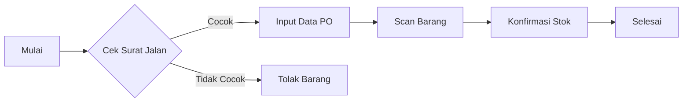

# í³¥ User Guide: Inbound Processing (Penerimaan Barang)

**Versi Dokumen:** 1.2  
**Terakhir Diperbarui:** 18 Nov 2025  
**Role:** Admin Inbound

---

## 1. Pendahuluan
Fitur **Inbound Processing** memungkinkan staf gudang untuk mencatat barang masuk dari *supplier* ke dalam sistem inventaris. Proses ini krusial untuk menjaga akurasi stok fisik dan sistem.

## 2. Prasyarat (*Prerequisites*)
Sebelum memulai proses inbound, pastikan:
* [ ] Anda memiliki akses akun dengan role `Admin` atau `Operator`.
* [ ] Surat Jalan (*Delivery Order*) fisik dari supplier telah diterima.
* [ ] Handheld Scanner (PDA) terhubung ke jaringan WiFi gudang.

## 3. Alur Kerja (*Workflow*)

## 4. Langkah-Langkah Detail

### Tahap 1: Verifikasi Dokumen
1.  Login ke aplikasi **GudangPintar**.
2.  Navigasi ke menu **Inbound** > **Penerimaan Baru**.
3.  Masukkan **Nomor PO (Purchase Order)** pada kolom pencarian.
    * *Catatan: Jika PO tidak ditemukan, hubungi tim Purchasing.*

### Tahap 2: Pemindaian Barang (*Scanning*)
1.  Klik tombol **Mulai Scan**.
2.  Arahkan scanner ke barcode SKU barang.
3.  Sistem akan menampilkan detail produk:
    * **Nama Produk:** (Misal: Kabel Data Type-C)
    * **SKU:** (Misal: ACC-001)
4.  Masukkan **Jumlah Diterima (Qty)**.
    > **⚠� PERINGATAN:** > Jika fisik barang rusak (*damaged*), jangan masukkan ke kolom 'Good Stock'. Gunakan tombol **'Report Damage'** di pojok kanan atas.

### Tahap 3: Finalisasi
1.  Periksa kembali ringkasan penerimaan.
2.  Klik tombol **Submit / Simpan**.
3.  Sistem akan mencetak *Bukti Penerimaan Barang* (GRN) secara otomatis.

## 5. Pemecahan Masalah (*Troubleshooting*)

| Pesan Error | Penyebab Kemungkinan | Solusi |
| :--- | :--- | :--- |
| `Error 404: SKU Not Found` | Barcode produk belum terdaftar di master data. | Input manual kode SKU atau lapor ke Supervisor. |
| `Warning: Qty Exceeds PO` | Jumlah yang diinput melebihi pesanan pembelian. | Hitung ulang fisik barang. Jika benar berlebih, minta persetujuan Manajer. |

---
**Butuh Bantuan?** Hubungi IT Support di ekstensi 101.
